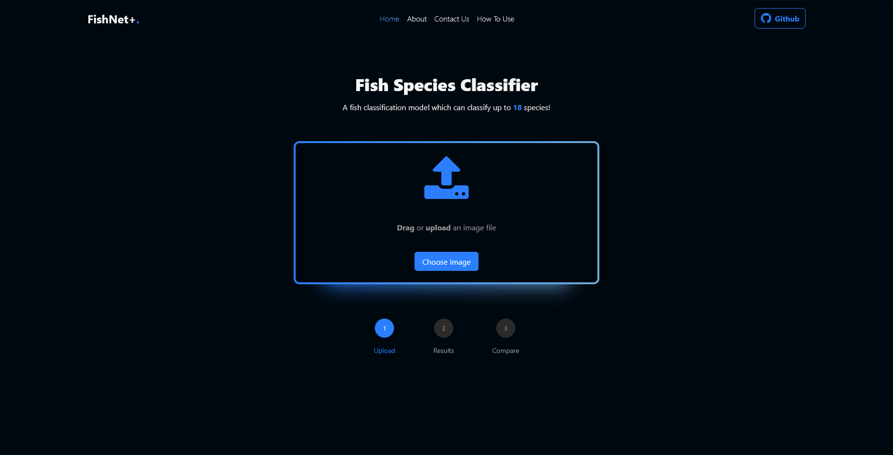
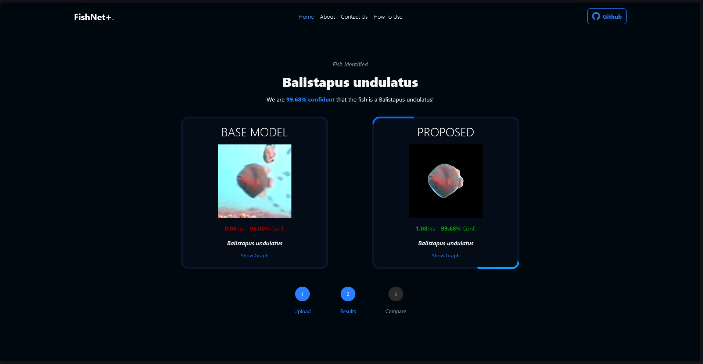
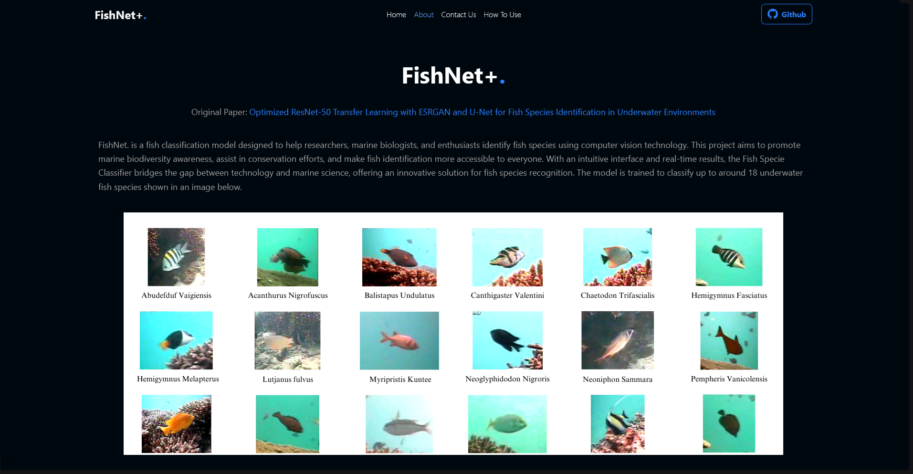

# 🐟 FishNet+

A machine learning project for recognizing fish species from images.

## Web Application (Getting Started)

1. **Clone the repository:**

   ```bash
   git clone https://github.com/kruizo/FishRNetv1.git
   cd FishRNetv1
   ```

2. **Run the installer** (WINDOWS ONLY)
   Navigate to **/Source Code** folder and double click on **start.bat** to start the web application. This will automatically download necessary and do all the necessary steps.


# If the installer fails, you can do the following steps (WINDOWS ONLY):

2. **Create & Activate Virtual Environment**

   ```bash
   python3 -m venv venv
   env/bin/activate
   ```

3. **Install dependencies:**

   ```bash
   pip install -r requirements.txt
   ```

   For CUDA supported devices, Run the following:

   ```bash
   python init.py
   ```

4. **Run the application**

   ```bash
   python app.py
   ```

## Training (Getting Started)

Navigate to **/training** folder and double click on **start.bat** to download the necessary requirements including the dataset. This will automatically download necessary and do all the necessary steps.

## Screenshots





## Acknowledgements

- This project is a thesis requirement with baseline from FishResNet study.
